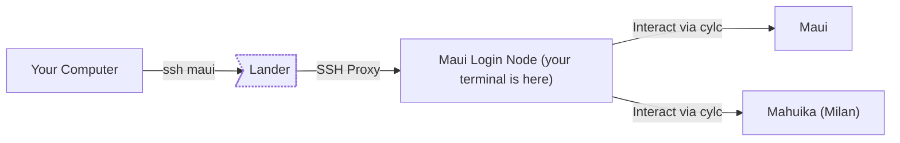

# Building Custom Workflows

The workflow is designed to be extended for research workflows besides Cybershake. This tutorial will guide you through the steps of adding your own workflow stages to perform an experiment.

The scenario we will test involves a simple experiment: Running two realisations side-by-side, where in one we shift the fault geometry down by 10km. We want to scale this workflow up to running dozens of simulations, so we want to automate the shifting by adding a workflow stage to do this for us.

# Copying a Template Workflow

The first stage to building any workflow is writing the `flow.cylc` file. To build this workflow file, we recommend either:

1. Building the workflow file by hand or,
2. Using the workflow planning script to build a template workflow.

For the sake of learning, we are going to build a workflow file by hand for a single realisation (the venerable NSHM rupture 0). The workflow planning script will make your life easier, see below for the tutorial on how to use this tool.

The `cylc/flow.cylc` in the workflow repository is a good starting place. For brevity we only include the low-frequency workflow. An exercise for the reader would be to complete the workflow for high-frequency and intensity measure calculation.

```
[scheduling]
    [[graph]]
        R1 = """
            nshm_to_realisation => realisation_to_srf & generate_velocity_model_parameters
            generate_velocity_model_parameters => generate_velocity_model & generate_station_coordinates & generate_model_coordinates
            realisation_to_srf & generate_velocity_model & generate_station_coordinates & generate_model_coordinates =>  create_e3d_par
            create_e3d_par => run_emod3d
            """
[runtime]
    [[root]]
        platform = mahuika-slurm
        pre-script = """
        module load Apptainer
        """
        [[[directives]]]
            --account = nesi00213
    [[nshm_to_realisation]]
        platform = localhost
        script = apptainer exec -c --bind "$PWD:/out,$CYLC_WORKFLOW_SHARE_DIR:/share,$CYLC_WORKFLOW_RUN_DIR/input:/input:ro" /nesi/nobackup/nesi00213/containers/runner_latest.sif nshm2022-to-realisation /nshmdb.db 0 /share/realisation.json develop
    [[realisation_to_srf]]
        script = apptainer exec -c --bind "$PWD:/out,$CYLC_WORKFLOW_SHARE_DIR:/share,$CYLC_WORKFLOW_RUN_DIR/input:/input:ro" /nesi/nobackup/nesi00213/containers/runner_latest.sif realisation-to-srf /share/realisation.json /share/realisation.srf
    [[generate_velocity_model_parameters]]
        platform = localhost
        script = apptainer exec -c --bind "$PWD:/out,$CYLC_WORKFLOW_SHARE_DIR:/share,$CYLC_WORKFLOW_RUN_DIR/input:/input:ro" /nesi/nobackup/nesi00213/containers/runner_latest.sif generate-velocity-model-parameters /share/realisation.json
    [[generate_velocity_model]]
        script = apptainer exec -c --bind "$PWD:/out,$CYLC_WORKFLOW_SHARE_DIR:/share,$CYLC_WORKFLOW_RUN_DIR/input:/input:ro" /nesi/nobackup/nesi00213/containers/runner_latest.sif sh -c 'generate-velocity-model /share/realisation.json /share/Velocity_Model --num-threads $(nproc)'
        [[[directives]]]
                --cpus-per-task = 32
                --time = 01:00:00
    [[generate_station_coordinates]]
        script = apptainer exec -c --bind "$PWD:/out,$CYLC_WORKFLOW_SHARE_DIR:/share,$CYLC_WORKFLOW_RUN_DIR/input:/input:ro" /nesi/nobackup/nesi00213/containers/runner_latest.sif generate-station-coordinates /share/realisation.json /share/stations
    [[generate_model_coordinates]]
        platform = localhost
        script = apptainer exec -c --bind "$PWD:/out,$CYLC_WORKFLOW_SHARE_DIR:/share,$CYLC_WORKFLOW_RUN_DIR/input:/input:ro" /nesi/nobackup/nesi00213/containers/runner_latest.sif generate-model-coordinates /share/realisation.json /share/model
    [[create_e3d_par]]
        platform = localhost
        script = apptainer exec /nesi/nobackup/nesi00213/containers/runner_latest.sif create-e3d-par $CYLC_WORKFLOW_SHARE_DIR/realisation.json $CYLC_WORKFLOW_SHARE_DIR/realisation.srf $CYLC_WORKFLOW_SHARE_DIR/Velocity_Model $CYLC_WORKFLOW_SHARE_DIR/stations $CYLC_WORKFLOW_SHARE_DIR/model $CYLC_WORKFLOW_SHARE_DIR/LF --emod3d-path /nesi/project/nesi00213/opt/maui/hybrid_sim_tools/emod3d-mpi_v3.0.8 --scratch-ffp $CYLC_WORKFLOW_SHARE_DIR/LF
    [[run_emod3d]]
        platform = maui-xc-slurm
        pre-script = ""
        script = srun /nesi/project/nesi00213/opt/maui/hybrid_sim_tools/emod3d-mpi_v3.0.8 -args "par=$CYLC_WORKFLOW_SHARE_DIR/LF/e3d.par"
        [[[directives]]]
            --ntasks = 80
            --hint = nomultithread
            --time = 00:30:00
```


The shifting would be done by adjusting the source geometry (see the [Realisations](Realisations.md) documentation) of the realisation after generating it from the NSHM database. We could do this by writing our stage.


# Building the Shifting Stage

This step requires two things:

1. Writing our custom code to adjust the source geometry,
2. Adding the stage into our workflow.

The first step is done by creating a Python file that reads the realisation and adjusts the source geometry, copying it into a new shifted realisation. The script is simple enough to be entirely contained here.

``` python
from workflow.realisations import SourceConfig
import shutil
import sys

input_realisation = Path(sys.argv[0])
output_realisation = Path(sys.argv[1])

# copy the old realisation to the new realisation
shutil.copy(input_realisation, output_realisation)

source_config = SourceConfig.read_from_realisation(input_realisation)

for _, fault in source_config.source_geometries.items():
    # Add 10000m to the depth of every fault corner
    fault.bounds[:, 2] += 10000

# write the changed source geometry back to the realisation
source_config.write_to_realisation(output_realisation)
```

Now we create a new stage for the workflow:

```
[[shift_fault]]
    platform = localhost
    script = apptainer exec -c --bind "$PWD:/out,$CYLC_WORKFLOW_SHARE_DIR:/share,$CYLC_WORKFLOW_RUN_DIR/bin:/bin" /nesi/nobackup/nesi00213/containers/runner_latest.sif python /bin/shift_fault.py /share/realisation.json /share/realisation_shift.json
```

Let's break this down line-by-line:

1. `[[shift_fault]]` declares the name of the new workflow stage
2. `platform = localhost` states that this stage runs on the login node (see [NeSI HPC Infrastructure](#nesi-hpc-infrastructure) for more details on platforms available). Broadly speaking, **you should run trivial tasks on localhost** to avoid using allocated core hours on the NeSI hardware. Examples of trivial tasks include moving or renaming files, or minor tweaks like the shifting script we just wrote.
3. `script =` starts the declaration of the script to execute in this stage.
4. `apptainer exec -c` invokes the `apptainer` executable telling the system to execute the following command inside a container (see [What is a Container?](#what-is-a-container)). **You should run tasks in a container** because the container has access to the latest versions of Python and has the environment set up already.
5. `--bind "..."` binds directories in the host system (that's where you execute Cylc from) into the container. The following table summarises the standard bindings we make.

| Path in host                  | Path in container | Purpose                                                                                                                                       |
|:------------------------------|:------------------|:----------------------------------------------------------------------------------------------------------------------------------------------|
| `~/cylc-run/<workflow>/share` | `/share`          | Files shared between workflow jobs (like realisations, or velocity models).                                                                   |
| `~/cylc-run/<workflow>/bin`   | `/bin`            | Extra binaries like user scripts                                                                                                              |
| Auto-generated job directory  | `/out`            | Directory for output that isn't shared (like checkpoint files, or per station high-frequency output). This directory is unique for every job. |

6. `/nesi/nobackup/nesi00213/containers/runner_latest.sif` is the path to the container to load.
7. `python /bin/shift_fault.py /share/realisation.json /share/realisation_shift.json` is the actual script we execute. Notice we use the path in the container rather than the host.

You are encouraged to read the [Cylc tutorial](https://cylc.github.io/cylc-doc/latest/html/tutorial/index.html) to how to write your own stages. You can write stages without using containers, but then you must ensure the python packages and system libraries are available at the time of execution.

We actually also need to copy some of the other stages and create `shift_` variants of these too, to use the geometry of the shifted realisations too. We will reuse the velocity model for each so those stages are not added.

After all this, you should have a `flow.cylc` that looks like the following:

```
[scheduler]
    allow implicit tasks = True
[scheduling]
    [[graph]]
        R1 = """
            nshm_to_realisation => realisation_to_srf & generate_velocity_model_parameters
            generate_velocity_model_parameters => generate_velocity_model & generate_station_coordinates & generate_model_coordinates
            realisation_to_srf & generate_velocity_model & generate_station_coordinates & generate_model_coordinates =>  create_e3d_par
            create_e3d_par => run_emod3d
            """
[runtime]
    [[root]]
        platform = mahuika-slurm
        pre-script = """
        module load Apptainer
        """
        [[[directives]]]
            --account = nesi00213
    [[nshm_to_realisation]]
        platform = localhost
        script = apptainer exec -c --bind "$PWD:/out,$CYLC_WORKFLOW_SHARE_DIR:/share,$CYLC_WORKFLOW_RUN_DIR/input:/input:ro" /nesi/nobackup/nesi00213/containers/runner_latest.sif nshm2022-to-realisation /nshmdb.db 0 /share/realisation.json develop
    [[realisation_to_srf]]
        script = apptainer exec -c --bind "$PWD:/out,$CYLC_WORKFLOW_SHARE_DIR:/share,$CYLC_WORKFLOW_RUN_DIR/input:/input:ro" /nesi/nobackup/nesi00213/containers/runner_latest.sif realisation-to-srf /share/realisation.json /share/realisation.srf
    [[generate_velocity_model_parameters]]
        platform = localhost
        script = apptainer exec -c --bind "$PWD:/out,$CYLC_WORKFLOW_SHARE_DIR:/share,$CYLC_WORKFLOW_RUN_DIR/input:/input:ro" /nesi/nobackup/nesi00213/containers/runner_latest.sif generate-velocity-model-parameters /share/realisation.json
    [[generate_velocity_model]]
        script = apptainer exec -c --bind "$PWD:/out,$CYLC_WORKFLOW_SHARE_DIR:/share,$CYLC_WORKFLOW_RUN_DIR/input:/input:ro" /nesi/nobackup/nesi00213/containers/runner_latest.sif sh -c 'generate-velocity-model /share/realisation.json /share/Velocity_Model --num-threads $(nproc)'
        [[[directives]]]
                --cpus-per-task = 32
                --time = 01:00:00
    [[generate_station_coordinates]]
        script = apptainer exec -c --bind "$PWD:/out,$CYLC_WORKFLOW_SHARE_DIR:/share,$CYLC_WORKFLOW_RUN_DIR/input:/input:ro" /nesi/nobackup/nesi00213/containers/runner_latest.sif generate-station-coordinates /share/realisation.json /share/stations
    [[generate_model_coordinates]]
        platform = localhost
        script = apptainer exec -c --bind "$PWD:/out,$CYLC_WORKFLOW_SHARE_DIR:/share,$CYLC_WORKFLOW_RUN_DIR/input:/input:ro" /nesi/nobackup/nesi00213/containers/runner_latest.sif generate-model-coordinates /share/realisation.json /share/model
    [[create_e3d_par]]
        platform = localhost
        script = apptainer exec /nesi/nobackup/nesi00213/containers/runner_latest.sif create-e3d-par $CYLC_WORKFLOW_SHARE_DIR/realisation.json $CYLC_WORKFLOW_SHARE_DIR/realisation.srf $CYLC_WORKFLOW_SHARE_DIR/Velocity_Model $CYLC_WORKFLOW_SHARE_DIR/stations $CYLC_WORKFLOW_SHARE_DIR/model $CYLC_WORKFLOW_SHARE_DIR/LF --emod3d-path /nesi/project/nesi00213/opt/maui/hybrid_sim_tools/emod3d-mpi_v3.0.8 --scratch-ffp $CYLC_WORKFLOW_SHARE_DIR/LF
    [[run_emod3d]]
        platform = maui-xc-slurm
        pre-script = ""
        script = srun /nesi/project/nesi00213/opt/maui/hybrid_sim_tools/emod3d-mpi_v3.0.8 -args "par=$CYLC_WORKFLOW_SHARE_DIR/LF/e3d.par"
        [[[directives]]]
            --ntasks = 80
            --hint = nomultithread
            --time = 00:30:00
    [[realisation_to_srf_shift]]
        script = apptainer exec -c --bind "$PWD:/out,$CYLC_WORKFLOW_SHARE_DIR:/share,$CYLC_WORKFLOW_RUN_DIR/input:/input:ro" /nesi/nobackup/nesi00213/containers/runner_latest.sif realisation-to-srf /share/realisation_shift.json /share/realisation_shift.srf
    [[create_e3d_par_shift]]
        platform = localhost
        # NOTE: We change the realisation.json and realisation.srf here too!
        script = apptainer exec /nesi/nobackup/nesi00213/containers/runner_latest.sif create-e3d-par $CYLC_WORKFLOW_SHARE_DIR/realisation_shift.json $CYLC_WORKFLOW_SHARE_DIR/realisation_shift.srf $CYLC_WORKFLOW_SHARE_DIR/Velocity_Model $CYLC_WORKFLOW_SHARE_DIR/stations $CYLC_WORKFLOW_SHARE_DIR/model $CYLC_WORKFLOW_SHARE_DIR/LF --emod3d-path /nesi/project/nesi00213/opt/maui/hybrid_sim_tools/emod3d-mpi_v3.0.8 --scratch-ffp $CYLC_WORKFLOW_SHARE_DIR/LF_shift
    [[generate_velocity_model_parameters_shift]]
        platform = localhost
        script = apptainer exec -c --bind "$PWD:/out,$CYLC_WORKFLOW_SHARE_DIR:/share,$CYLC_WORKFLOW_RUN_DIR/input:/input:ro" /nesi/nobackup/nesi00213/containers/runner_latest.sif generate-velocity-model-parameters /share/realisation_shift.json
    [[run_emod3d_shift]]
        platform = maui-xc-slurm
        pre-script = ""
        script = srun /nesi/project/nesi00213/opt/maui/hybrid_sim_tools/emod3d-mpi_v3.0.8 -args "par=$CYLC_WORKFLOW_SHARE_DIR/LF_shift/e3d.par"
        [[[directives]]]
            --ntasks = 80
            --hint = nomultithread
            --time = 00:30:00
    [[shift_fault]]
        platform = localhost
        script = apptainer exec -c --bind "$PWD:/out,$CYLC_WORKFLOW_SHARE_DIR:/share,$CYLC_WORKFLOW_RUN_DIR/bin:/bin" /nesi/nobackup/nesi00213/containers/runner_latest.sif python /bin/shift_fault.py /share/realisation.json /share/realisation_shift.json
```

You are now ready to update the workflow graph.

# Update the Workflow Graph

The workflow graph controls the order in which jobs are executed. The old flow had the following diagram.

```
[scheduling]
    [[graph]]
        R1 = """
            nshm_to_realisation => realisation_to_srf & generate_velocity_model_parameters
            generate_velocity_model_parameters => generate_velocity_model & generate_station_coordinates & generate_model_coordinates
            realisation_to_srf & generate_velocity_model & generate_station_coordinates & generate_model_coordinates =>  create_e3d_par
            create_e3d_par => run_emod3d
            """
```


We should now introduce the shifted realisation generation after the `nshm_to_realisation` stage and create a workflow parallel to the first.


Which looks like the following in the Cylc flow graph.

```
[scheduling]
    [[graph]]
        R1 = """
            nshm_to_realisation => realisation_to_srf & generate_velocity_model_parameters & shift_fault
            shift_fault => realisation_to_srf_shift
            realisation_to_srf_shift => generate_velocity_model_parameters_shift
            realisation_to_srf_shift & generate_velocity_model_parameters_shift & generate_velocity_model & generate_station_coordinates & generate_model_coordinates => create_e3d_par_shift
            create_e3d_par_shift => run_emod3d_shift

            generate_velocity_model_parameters => generate_velocity_model & generate_station_coordinates & generate_model_coordinates
            realisation_to_srf & generate_velocity_model & generate_station_coordinates & generate_model_coordinates =>  create_e3d_par
            create_e3d_par => run_emod3d
            """
```

So your flow.cylc should now look like:

```

[scheduler]
    allow implicit tasks = True
[scheduling]
    [[graph]]
        R1 = """
            nshm_to_realisation => realisation_to_srf & generate_velocity_model_parameters & shift_fault
            shift_fault => realisation_to_srf_shift
            realisation_to_srf_shift => generate_velocity_model_parameters_shift
            realisation_to_srf_shift & generate_velocity_model_parameters_shift & generate_velocity_model & generate_station_coordinates & generate_model_coordinates => create_e3d_par_shift
            create_e3d_par_shift => run_emod3d_shift

            generate_velocity_model_parameters => generate_velocity_model & generate_station_coordinates & generate_model_coordinates
            realisation_to_srf & generate_velocity_model & generate_station_coordinates & generate_model_coordinates =>  create_e3d_par
            create_e3d_par => run_emod3d
            """
[runtime]
    [[root]]
        platform = mahuika-slurm
        pre-script = """
        module load Apptainer
        """
        [[[directives]]]
            --account = nesi00213
    [[nshm_to_realisation]]
        platform = localhost
        script = apptainer exec -c --bind "$PWD:/out,$CYLC_WORKFLOW_SHARE_DIR:/share,$CYLC_WORKFLOW_RUN_DIR/input:/input:ro" /nesi/nobackup/nesi00213/containers/runner_latest.sif nshm2022-to-realisation /nshmdb.db 0 /share/realisation.json develop
    [[realisation_to_srf]]
        script = apptainer exec -c --bind "$PWD:/out,$CYLC_WORKFLOW_SHARE_DIR:/share,$CYLC_WORKFLOW_RUN_DIR/input:/input:ro" /nesi/nobackup/nesi00213/containers/runner_latest.sif realisation-to-srf /share/realisation.json /share/realisation.srf
    [[generate_velocity_model_parameters]]
        platform = localhost
        script = apptainer exec -c --bind "$PWD:/out,$CYLC_WORKFLOW_SHARE_DIR:/share,$CYLC_WORKFLOW_RUN_DIR/input:/input:ro" /nesi/nobackup/nesi00213/containers/runner_latest.sif generate-velocity-model-parameters /share/realisation.json
    [[generate_velocity_model]]
        script = apptainer exec -c --bind "$PWD:/out,$CYLC_WORKFLOW_SHARE_DIR:/share,$CYLC_WORKFLOW_RUN_DIR/input:/input:ro" /nesi/nobackup/nesi00213/containers/runner_latest.sif sh -c 'generate-velocity-model /share/realisation.json /share/Velocity_Model --num-threads $(nproc)'
        [[[directives]]]
                --cpus-per-task = 32
                --time = 01:00:00
    [[generate_station_coordinates]]
        script = apptainer exec -c --bind "$PWD:/out,$CYLC_WORKFLOW_SHARE_DIR:/share,$CYLC_WORKFLOW_RUN_DIR/input:/input:ro" /nesi/nobackup/nesi00213/containers/runner_latest.sif generate-station-coordinates /share/realisation.json /share/stations
    [[generate_model_coordinates]]
        platform = localhost
        script = apptainer exec -c --bind "$PWD:/out,$CYLC_WORKFLOW_SHARE_DIR:/share,$CYLC_WORKFLOW_RUN_DIR/input:/input:ro" /nesi/nobackup/nesi00213/containers/runner_latest.sif generate-model-coordinates /share/realisation.json /share/model
    [[create_e3d_par]]
        platform = localhost
        script = apptainer exec /nesi/nobackup/nesi00213/containers/runner_latest.sif create-e3d-par $CYLC_WORKFLOW_SHARE_DIR/realisation.json $CYLC_WORKFLOW_SHARE_DIR/realisation.srf $CYLC_WORKFLOW_SHARE_DIR/Velocity_Model $CYLC_WORKFLOW_SHARE_DIR/stations $CYLC_WORKFLOW_SHARE_DIR/model $CYLC_WORKFLOW_SHARE_DIR/LF --emod3d-path /nesi/project/nesi00213/opt/maui/hybrid_sim_tools/emod3d-mpi_v3.0.8 --scratch-ffp $CYLC_WORKFLOW_SHARE_DIR/LF
    [[run_emod3d]]
        platform = maui-xc-slurm
        pre-script = ""
        script = srun /nesi/project/nesi00213/opt/maui/hybrid_sim_tools/emod3d-mpi_v3.0.8 -args "par=$CYLC_WORKFLOW_SHARE_DIR/LF/e3d.par"
        [[[directives]]]
            --ntasks = 80
            --hint = nomultithread
            --time = 00:30:00
    [[realisation_to_srf_shift]]
        script = apptainer exec -c --bind "$PWD:/out,$CYLC_WORKFLOW_SHARE_DIR:/share,$CYLC_WORKFLOW_RUN_DIR/input:/input:ro" /nesi/nobackup/nesi00213/containers/runner_latest.sif realisation-to-srf /share/realisation_shift.json /share/realisation_shift.srf
    [[create_e3d_par_shift]]
        platform = localhost
        # NOTE: We change the realisation.json and realisation.srf here too!
        script = apptainer exec /nesi/nobackup/nesi00213/containers/runner_latest.sif create-e3d-par $CYLC_WORKFLOW_SHARE_DIR/realisation_shift.json $CYLC_WORKFLOW_SHARE_DIR/realisation_shift.srf $CYLC_WORKFLOW_SHARE_DIR/Velocity_Model $CYLC_WORKFLOW_SHARE_DIR/stations $CYLC_WORKFLOW_SHARE_DIR/model $CYLC_WORKFLOW_SHARE_DIR/LF --emod3d-path /nesi/project/nesi00213/opt/maui/hybrid_sim_tools/emod3d-mpi_v3.0.8 --scratch-ffp $CYLC_WORKFLOW_SHARE_DIR/LF_shift
    [[generate_velocity_model_parameters_shift]]
        platform = localhost
        script = apptainer exec -c --bind "$PWD:/out,$CYLC_WORKFLOW_SHARE_DIR:/share,$CYLC_WORKFLOW_RUN_DIR/input:/input:ro" /nesi/nobackup/nesi00213/containers/runner_latest.sif generate-velocity-model-parameters /share/realisation_shift.json
    [[run_emod3d_shift]]
        platform = maui-xc-slurm
        pre-script = ""
        script = srun /nesi/project/nesi00213/opt/maui/hybrid_sim_tools/emod3d-mpi_v3.0.8 -args "par=$CYLC_WORKFLOW_SHARE_DIR/LF_shift/e3d.par"
        [[[directives]]]
            --ntasks = 80
            --hint = nomultithread
            --time = 00:30:00
    [[shift_fault]]
        platform = localhost
        script = apptainer exec -c --bind "$PWD:/out,$CYLC_WORKFLOW_SHARE_DIR:/share,$CYLC_WORKFLOW_RUN_DIR/bin:/bin" /nesi/nobackup/nesi00213/containers/runner_latest.sif python /bin/shift_fault.py /share/realisation.json /share/realisation_shift.json
```

# Running the Simulation
Now that the hard work is done, running the simulation is simple. Move the `flow.cylc` to the `~/cylc-src/custom/` directory and then execute the steps `cylc install custom` and `cylc play custom`. Refer to the [workflow basic tutorial](Using-Workflow.md) for additional details on this step.

# NeSI HPC Infrastructure

The high performance computing (HPC) resources provided by NeSI consist of a cluster of computers that are available to use. NeSI provides a detailed [overview](https://docs.nesi.org.nz/Scientific_Computing/The_NeSI_High_Performance_Computers/) of the computers and what they can be used for. Here is the executive summary **for the new workflow**:

| Platform      | Purpose to QuakeCoRE                                                                                                                                                             |
|:--------------|:---------------------------------------------------------------------------------------------------------------------------------------------------------------------------------|
| Mahuika       | Big cluster of Linux computers (nodes) working in concert. All jobs except EMOD3D are run in the special Milan computers (nodes).                                                |
| Maui          | Specialised Cray supercomputer used for jobs that make use of [MPI](https://www.open-mpi.org/) to parallelise tasks across multiple computers (nodes) at once. Just used for EMOD3D |
| Mahuika Milan | Next-generation Linux cluster with container support. Our jobs are run on Milan wherever possible.                                                                                |
| Lander02      | The computer which we use to access the other platforms.                                                                                                                         |

When you connect to a NeSI host like maui you reach what is called the _login node_. This session is where you execute `cylc install` and where trivial tasks are executed. This information is summarised below.



# What is a Container?

In simple terms, a container is a virtual computer that runs on top of another computer (called the host). The virtual computer inherits some of the host computer's infrastructure but crucially contains a different set of libraries and executables. We use containers at QuakeCoRE for a few purposes:

1. To isolate the workflow stages, so that every workflow stage is run with the same state to minimise the surface area for bugs.
2. To simplify environment management, so that it is easier for researchers to build their own workflow stages.
3. To ensure the workflow is run with the latest software versions for things like Python and GMT. NeSI maintains its own versions but can be slow to keep them up to date.

See [this video](https://www.youtube.com/watch?v=Gjnup-PuquQ) for a two-minute visual explainer on containers. Note that we use [Apptainer](https://apptainer.org/) containers as opposed to Docker containers, but the concepts are still the same.

# Using the Workflow Planning Tool

We often need to run the same jobs for a number of realisations. Building the Cylc workflow by hand for this can be tedious. Hence, we have built a workflow planning tool that can flexibly generate workflow scripts for the common case of:

1. You want to simulate a number of realisations in the same way and,
2. you want to do this with a subset of the full Cybershake workflow.

The tool is available if you install the workflow using pip:

``` bash
pip install workflow @ https://github.com/ucgmsim/workflow
```

The script to plan workflow is called `plan-workflow`. If you want to plan workflows for two events identically to Cybershake you can execute

``` bash
plan-workflow Fault_1 Fault_2 ~/cylc-src/template/flow.cylc --goal im_calc
```

This will create a workflow file `flow.cylc` to simulate two faults: Fault 1 and Fault 2, targeting intensity measure calculation. Running `cylc install template` and then `cylc graph template`, you should see an output like the following

<details open>
<summary><b>Cylc Graph Test</b></summary>


</details>

If you also want the `plot_ts` stage you can add it as a goal to the workflow plan.

``` bash
plan-workflow Fault_1 Fault_2 ~/cylc-src/template/flow.cylc --goal im_calc --goal plot_ts
```

<details open>
<summary><b>Cylc Graph with <pre>plot_ts</pre></b></summary>


</details>

The workflow planning tool is pretty flexible. You can exclude any task you want if you, for example, already have the output for a stage completed (like a custom SRF). To exclude a stage, use the `--excluding` option. Currently our generated workflows have assumed that `Fault_1` and `Fault_2` are sourced from the NSHM 2022 database. But if you have a custom realisation file to simulate, you can use the `--excluding` option to excluding the `nshm_to_realisation` stage.

``` bash
plan-workflow Fault_1 Fault_2 ~/cylc-src/template/flow.cylc --goal im_calc --goal plot_ts --excluding nshm_to_realisation
```

<details open>
<summary><b>Cylc Graph with <pre>plot_ts</pre> and No Realisation Generation</b></summary>


</details>

You can use `--excluding-group` to exclude a predefined group of workflow stages. If you have completed all the pre-processing stages, for example, you can exclude the `preprocessing` group to plan simulation only.

``` bash
plan-workflow Fault_1 Fault_2 ~/cylc-run/test/runN/flow.cylc --goal im_calc  --excluding-group preprocessing
```

<details open>
<summary><b>Cylc Graph with <pre>plot_ts</pre> and No Realisation Generation</b></summary>


</details>

Often times, we want to run a number of realisations of the same event: varying the magnitude, rupture propagation, and hypocentre of an event without changing the domain or velocity model. The workflow planner tool has support to generate workflows that reuse the velocity model for a number of realisations.

``` bash
plan-workflow Event Event:1  ~/cylc-run/test/runN/flow.cylc --goal create_e3d_par
```

<details open>
<summary><b>Cylc Graph with Shared Velocity Model</b></summary>


</details>

Notice that there is only `generate_velocity_model` job in this workflow, and the `create_e3d_par` jobs for Event and Event:1 (a different sample of Event) both use the velocity model from the main sample of the event.

The `cylc graph` tool is hard to use for large workflows. The `--visualise` flag for the workflow planner opens the planned workflow in your browser. You can drag stages around and zoom in to understand the generated workflow execution graph.

``` bash
plan-workflow Event Event:1 ~/cylc-src/template/.cylc --goal im_calc --goal plot_ts --visualise
```

<details open>
<summary><b>Cylc Graph with Shared Velocity Model</b></summary>


</details>
