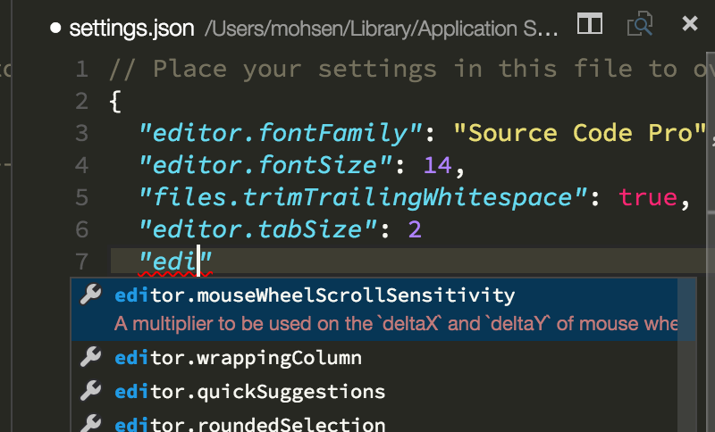

# Realisation Specification
A realisation is the concrete specification of a single ground motion
simulation. We currently have multiple files that make up the
specification of a single realisation.

1. A `root_params.yaml` file that specifies the parameters for a
   single cybershake run.
2. A `fault_params.yaml` file that specifies the parameters for all
   realisations involving a given fault in a single cybershake run.
3. A realisation file (CSV, or YAML for type-5) that specifies the
   source model parameters (source geometry, magnitude, genslip and
   srfgen seeds, etc) for a single realisation.
4. A `sim_params.yaml` file that specifies the other parameters for a
   single realisation (HF, BB, IM parameters, EMOD3D parameters).
5. A separate YAML file with a filename pattern `RELNAME.yaml` that
   mostly contains the same information as `sim_params.yaml`.

This split has some advantages. The main advantage is that you can
modify the parameters in a hierarchical fashion. Changes to the EMOD3D
run parameters for all realisations in a single cybershake run can be
made at the level of `root_params.yaml` file. Almost certainly a
motivating factor for the `sim_params.yaml` and realisation file split
is that the old simulations were specified in CSV, which is not well
suited to the hierarchical data supplied in `sim_params.yaml`.

However, the split has many disadvantages. It massively complicates
the workflow because we have to remember to read each of these files
(and in the correct order). These files are created independently of
each other, and hence can independently fail to be created or be
corrupted. The combinatorial explosion in realisation state makes the
workflow brittle. While the separation of simulation parameters and
realisation parameters made sense when these were in different
formats, type-5 realisation files could easily involve both
parameters. The split also means it is more difficult to reproduce the
results of a single simulation, because if we do not archive any one
of the four files we are missing some parameters determining the
simulation outcome.

With an upcoming move to a Pegasus workflow, it's clear we need to
rethink realisation parameters. At the very least, whatever solution
we land on needs to be fully specified so we can develop tools against
it that verify the files. We need to document our methodology so that
in the future we can understand why certain decisions were made. This
page is a proposal of a fully specified realisation format and a scope
of what should be contained in a realisation file.

# Design Aims of the New Realisation Format
The key design aims of the new realisation format are as follows:

1. **Readability**. Researchers are domain experts in earthquake
   research, not computer science. Realisations should be specified in
   a plain-text and logical format. Ideally, the file(s) should be
   self-documenting, i.e. attached to each variable is documentation
   or comments explaining what it is, how it affects the workflow, and
   the acceptable values.
2. **Writability**. Previously we have privileged creating
   realisations via automated workflows with GCMT and NSHM. It is
   frustrating to try and run a simulation with custom geometry or
   simulation parameters because the specifications are too complicated
   and undocumented to write ourselves. Any new specification should
   be accompanied with tools that makes writing custom realisations easy.
3. **Referential Transparency**. Running a simulation twice with the
   same realisation file(s) should produce the same simulation output.
   This cannot be completely controlled by a realisation due to
   reliance on external data files and differences in hardware, but we
   can strive for the ideal here.
4. **Validation**. It should be possible to verify that every
   parameter in the realisation file(s) are specified correctly. If
   the values are not specified correctly, tools should exist that can
   report the error in language that researchers can understand to fix
   the problem.
   
   
# The Proposed Solution
We propose a simplified realisation specification that involves a
single file written in a JSON file format. This JSON file does the job
of the four files previously specifying realisations by including all
the source modelling parameters, and all the simulation parameters for
a single realisation. To ameliorate the loss of the hierarchical
modification in the old model, we will
write better tools to generate many different realisations so that
changes can be made in bulk. 

The main components of this solution will be:

1. A library to read and write JSON realisation files.
2. A document produced that describes a valid JSON realisation file.
3. A tool to validate JSON realisation files.

The main reason to choose JSON over YAML is that it allows us to
produce a [JSON Schema](https://json-schema.org/) for realisations.
JSON schemas are a documented, standardised, validated format for data
exchange used by many large companies like Zapier, Microsoft, Postman,
and GitHub. JSON schemas have extensive tooling built around them.
They allow, for example, text editors like VSCode to provide
documentation, auto-completion, and validation whilst you are writing
them (making custom simulations easier). There is [extensive library
support](https://json-schema.org/implementations) for validating
schemas in many programming languages. There are [CLI
tools](https://github.com/python-jsonschema/check-jsonschema) that can
validate files against JSON schemas, including even one built [built
into Microsoft
PowerShell](https://learn.microsoft.com/en-us/powershell/module/microsoft.powershell.utility/test-json).
Tools like Apple's [PKL](https://pkl-lang.org/index.html) language
format for configuration offer an (arguably superior)
alternative, but are probably too new for a mature scientific pipeline
to rely on. JSON schemas, on the other hand, are well-established.



Using the schema, we can automatically generate a document
describing the realisation file, and can off-load the validation to
existing tools. Leaving us to produce only: A library for reading JSON
files and a schema.

Currently realisations are generated in the automated pipeline for
GCMT and NSHM. There are no exposed tools to create custom
realisations except a broken library. For the new specification, we
propose an **inversion** of the original logic of realisation
generation: write a user-facing custom realisation building library
first. The GCMT and NSHM generation scripts would use this libary in
their automated pipeline. This change means that custom realisations
are first-class in the new framework and updated in lock-step with
simulation changes introduced to the automated workflow. Using
software design patterns like the Builder pattern, one could imagine
the custom interface to look something like

```python 
# Loop over a bunches of sources from: NSHMDB, GCMT, Custom outputs
realisation = RealisationBuilder('REALISATION NAME')
                 .with_seed(SEED)
                 #          ^- used for randomised values
                 .with_sources({
                     'Some Fault Name': Plane(some_corners)
                 })
                 .with_magnitude(7, proportioned_to_faults_automatically=True)
                 # or: with magnitude + custom magnitude proportions
                 .with_rupture_propagation(use_automatic_propogation=True)
                 # or: with a custom rupture propagation tree to specify fault jumping
                 .with_jump_locations(random=True)
                 # or: with custom jump locations
                 .with_hypocentre(random=True)
                 # or: with a fault + fault-local coordinates for the hypocentre
                 .with_simulation_parameters(defaults=True)
                 # and: with keyword overrides for any simulation parameters for this run
                 .build()
                 # Will throw a descriptive error if any of the above
                 # steps fail, to allow for validation.

realisation.save('realisation_filepath.json')
```

Let's review how this tackles each of our design aims:

1. **Readability**. JSON is a plain-text format with a logical layout.
   The syntax is similar to Python dictionaries, which researchers
   will be familiar with through exposure to Python programming. One
   could argue it is less readable than YAML, however the addition of
   the schema allows powerful documentation tools that more than make
   up for the loss of syntax sugar.
2. **Writability**. The library proposed will allow researchers to
   generate custom realisations in bulk in Python. The Builder pattern
   is well-established in the Software industry as a solution for
   building complex objects with a simple interface.
3. **Referential Transparency**. The realisation file specification is
   now the one source of truth for simulation parameters. This one
   file along with the data files now completely determines the
   realisation up to hardware differences.
4. **Validation**. Realisation files now have a completely specified
   schema using industry standard tooling to validate input files. We
   immediately gain the benefits of all the lessons learned building
   the JSON schema format, and we can catch errors in the realisation
   specification before they end up in the workflow burning core
   hours.

# A High Level Example of Realisation Files
While the details of the realisation specification will come from the resulting schema, a high-level example of this format would look something like:

```json
{
  "name": "Realisation Name",
  "realisation_specification_version": 5,
  "sources": {
    "Acton": {
      "type": "Fault", // or Plane, or Point (see Sources documentation).
      "planes": [
        {
          "corners": [
            { "lat": -45.4444, "lon": 168.3711, "depth": 0 },
            { "lat": -45.4761, "lon": 168.3553, "depth": 0 },
            { "lat": -45.4946, "lon": 168.5536, "depth": 27120 },
            { "lat": -45.4628, "lon": 168.5963, "depth": 27120 },
          ]
        }
      ]
    }
  },
  "rupture_propogation": {
    "Acton": {
      "parent": null, // specifies acton is the initial fault in the rupture
      "hypocentre": [0.5, 0.5], // hypocentre in fault-local coordinates (see Sources docs)
      "magnitude": 7,
      "rake": 110
    } 
  }, // Total rupture moment magnitude is sum of powers of fault magnitudes.
  "source_parameters": {
    "genslip_dt": 0.05, // for genslip generation
    "genslip_seed": 1,
    "genslip_version": "5.4.2",
    "srfgen_seed": 1
  },
  "domain_parameters": {
    "resolution": 0.1,
    "model_latitude": -45.5,
    "model_longitude": 168.5,
    "model_rotation": 170,
    "model_width": 100,
    "model_length": 100,
    "model_depth": 40
  },
  "simulation_parameters" : {
    "VM": {},
    "HF": {},
    "BB": {},
    "LF": {},
    // etc...
  }
}
```

# Implementation Details

The structure of the realisation implementation would consist of three components:


1. A `Realisation` object containing all the details of the
   realisation loaded from the JSON file. There may be other classes
   within this object like `SourceParameters` etc.
2. A `RealisationBuilder` object that allows us to build realisations
   efficiently. This may be elided and the `Realisation` object might
   contain this functionality, but at least initially this separation
   seems sensible.
3. A JSON schema specified by the [schema
   library](https://pypi.org/project/schema/). The schema library
   allows us to validate realisations with the composability of
   standard Python values. This will make building a realisation
   schema feasible. Schemas made with the schema library can be
   compiled into JSON schemas that other tools like editors and CLI
   tools can read. The schemas can then also be used for the
   `RealisationBuilder` object for validation too.
   
This will be updated as the implementation is completed and the details are ironed out.

# Implementation Roadmap
Initially the simulation parameters for the realisation will
essentially be ignored. The Minimum Viable Product would be porting
the existing type-5 realisation spec for YAML to JSON with the schema
library validating the format. The new realisation format would be
used in the generation of SRFs and VM parameters for type-5
realisations, but the existing code and workflow would never need to
know that this is using the new format.

This will allow a drop in replacement for the existing slurm workflow
that doesn't require changing any of the existing code (except to
change references to YAML to references to JSON for type-5
realisations). Then, as we migrate from slurm\_gm\_workflow to Pegasus
we can have the new scripts read parameters from the JSON realisation
file rather than YAML files incrementally. This allows for a gradual
transition to the new specification rather than an all-at-once shift.
