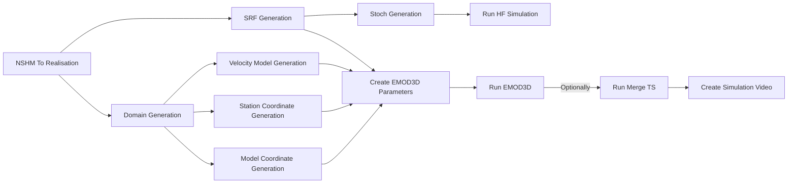

# Workflow Stages

The workflow repository contains all the tools necessary to build a
workflow for ground motion model simulations. We build and maintain a
Cybershake workflow, but researchers may wish to build their own. For
this reason, the workflow is build out of composable parts we intend
for anyone to reuse to build their own workflow based on the
Cybershake workflow. Below you will find documentation for all the
workflow stages, their inputs, outputs and environments.

Many of the stages will run in a _container_. A container is a self-contained execution environment with all the system and Python libraries required to execute workflow stages. It is also isolated from the host system and may not be able to access certain directories. We maintain a [cybershake container](https://hub.docker.com/r/earthquakesuc/runner) that has a copy of the latest validated workflow, and environment. Use this container as much as possible in your own scripts to run your code.

## NSHM To Realisation

- **Description:** Construct a realisation from a rupture in the [NSHM 2022](https://nshm.gns.cri.nz/RuptureMap).
- **Inputs:**
   1. A copy of the [NSHM 2022 database](https://www.dropbox.com/scl/fi/50kww45wpsnmtf3pn2okz/nshmdb.db?rlkey=4mjuomuevl1963fjwfximgldm&st=50ax73gl&dl=0).
   2. A rupture id to simulate. You can find a rupture id from the [rupture explorer](https://nshm.gns.cri.nz/RuptureMap). Alternatively, you can use the visualisation tools to find one.
   3. The version of the [scientific defaults](https://github.com/ucgmsim/workflow/blob/pegasus/workflow/default_parameters/README.md#L1) to use. If you don't know what version to use, choose the latest version. Versions are specified as `YY.M.D.R`, where `R` is the resolution of the simulation (1 = 100m). For example `24.2.2.1`. The special `develop` version is for testing workflow iterations and not to be used for accurate scientific simulation.
- **Outputs:** A realisation file containing:
  1. The definition of all the faults in the the rupture,
  2. A rupture propagation plan (i.e. how the rupture jumps between faults, and where),
  3. The estimated rupture magnitude and apportionment to the involved faults.
  4. The definition of the rakes.
- **Environment**: Can be run in the cybershake container. Can also be run from your own computer using the `nshm2022-to-realisation` command which is installed after running `pip install workflow@git+https://github.com/ucgmsim/workflow`.
- **For More Help**: See the output of `nshm2022-to-realisation --help` or [nshm2022\_to\_realisation.py](https://github.com/ucgmsim/workflow/blob/pegasus/workflow/scripts/nshm2022_to_realisation.py).

## SRF Generation
- **Description:** Produce an SRF from a realisation.
- **Inputs:** A realisation file containing:
  1. A source configuration,
  2. A rupture propagation configuration,
  3. A metadata configuration.

  Typically, this information comes from a stage like [NSHM To Realisation](#nshm-to-realisation).

- **Outputs:**
  1. An [SRF](https://wiki.canterbury.ac.nz/display/QuakeCore/File+Formats+Used+In+Ground+Motion+Simulation#FileFormatsUsedInGroundMotionSimulation-SRFFormat) file containing the source slip definition for the realisation,
  2. An updated realisation file containing the parameters used for SRF generation copied from the scientific defaults.

- **Environment**: Can be run in the cybershake container. Can also be run from your own computer using the `realisation-to-srf` command which is installed after running `pip install workflow@git+https://github.com/ucgmsim/workflow`. If you are executing on your own computer you also need to specify the work directory (with the `--work-directory` flag), a 1D velocity model (`--velocity-model-ffp`), and the path to a genslip binary (`--genslip-path`).

- **For More Help:** See the output of `realisation-to-srf --help` or [realisation_to_srf.py](https://github.com/ucgmsim/workflow/blob/pegasus/workflow/scripts/realisation_to_srf.py)
- **Visualisation:** You can visualise the output of this stage using the SRF plotting tools in the [source modelling](https://github.com/ucgmsim/source_modelling/blob/plots/wiki/Plotting-Tools.md) repository. Many of the tools take realisations as optional arguments to enhance the plot output.

## Stoch Generation
- **Description:** Generate Stoch file for HF simulation. This file is just a down-sampled version of the SRF.
- **Inputs:** A realisation file containing a metadata configuration, and a generated SRF file.
- **Outputs:** A [Stoch](https://wiki.canterbury.ac.nz/display/QuakeCore/File+Formats+Used+In+Ground+Motion+Simulation#FileFormatsUsedInGroundMotionSimulation-Stochformat) file containing a down-sampled version of the SRF.
- **Environment**: Can be run in the cybershake container. Can also be run from your own computer using the `generate-stoch` command which is installed after running `pip install workflow@git+https://github.com/ucgmsim/workflow`. If you are executing on your own computer you also need to specify the `srf2stoch` path (`--srf2stoch-path`).
- **For More Help:** See the output of `generate-stoch --help` or [generate_stoch.py](https://github.com/ucgmsim/workflow/blob/pegasus/workflow/scripts/generate_stoch.py)
## Domain Generation
- **Description:** Find a suitable simulation domain, estimating a rupture radius that captures significant ground motion, and the time the simulation should run for to capture this ground motion.
- **Inputs:** A realisation file containing a metadata configuration, source definitions and rupture propagation information.

- **Outputs:** A realisation file containing velocity model and domain extent parameters.

- **Environment**: Can be run in the cybershake container. Can also be run from your own computer using the `generate-velocity-model-parameters` command which is installed after running `pip install workflow@git+https://github.com/ucgmsim/workflow`.

- **For More Help:** See the output of `generate-velocity-model-parameters --help` or [generate_velocity_model_parameters.py](https://github.com/ucgmsim/workflow/blob/pegasus/workflow/scripts/generate_velocity_model_parameters.py).
