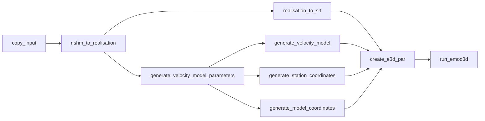
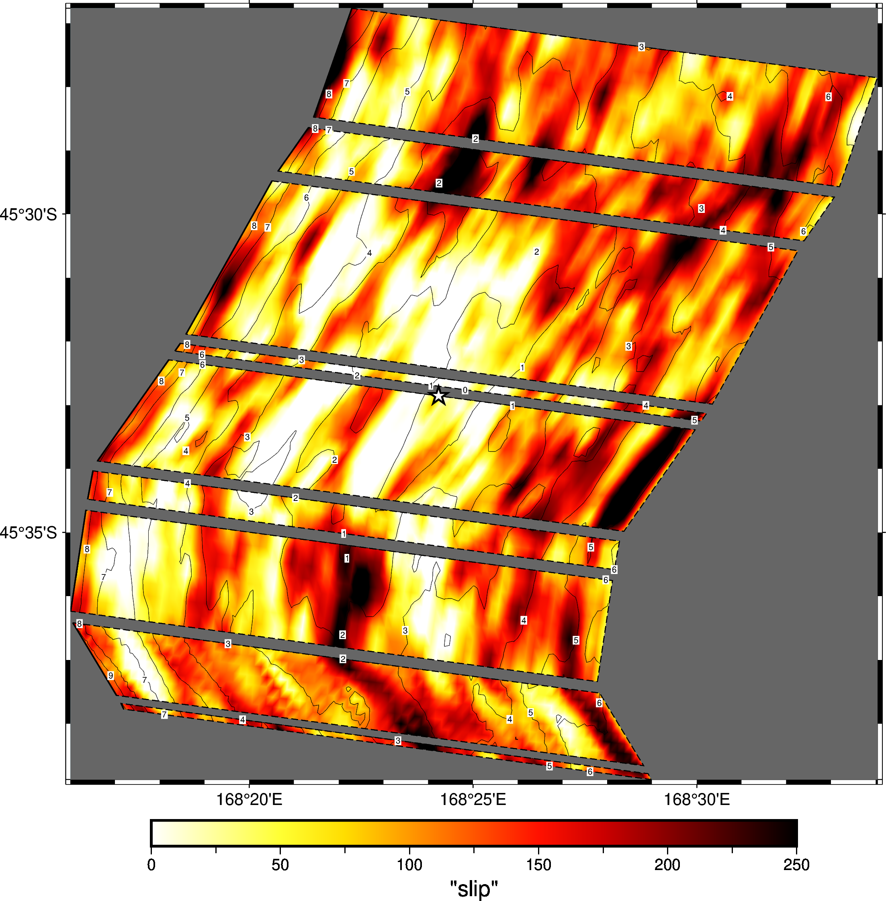
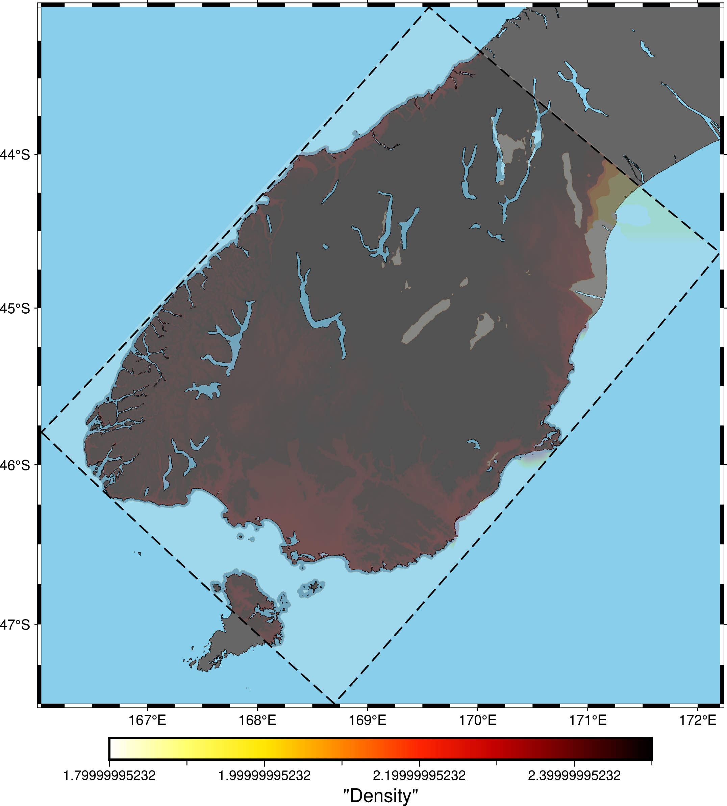

# What Is a Workflow?
When we talk about "running a ground motion simulation", we really mean this as shorthand for a whole process of tasks that must be completed. Just a simple ground motion simulation of only low-frequency waveforms requires:

1. Defining the fault geometry for the event,
2. Determining the simulation domain (how much of New Zealand to simulate, and how long the simulation should last)
3. Generating the initial conditions (what is the slip on the fault, how fast can waves propagate through the ground at various locations and depths)
4. Running the simulation with these inputs using a finite-difference PDE solver

This is, of course, very high-level. In practice, each step also has sub-steps. Moreover, the jobs have dependencies and inputs; you can't run the finite-difference solver until you've defined the domain to simulate and the slip on the fault.

We define a _workflow_ to be all the following:

1. The definition of the steps in the process,
1. the dependencies between these steps,
1. the code used to execute the steps, and
1. the inputs to these steps.

The outputs of the workflow are what we think of when we think of a "ground motion simulation". That is, the broadband seismic waveforms, the intensity measures, or the fault slip definitions, or anything else produced as a product of the steps defined in the workflow.

# NeSI and Workflow Infrastructure

[NeSI](https://www.nesi.org.nz/) is the New Zealand eScience Infrastructure organisation. NeSI provides a national platform of shared high-performance computing tools and eResearch services. NeSI owns two platforms we make extensive use of:

- **The Maui Supercomputer:** This is a specialised Cray supercomputer. Initially targeted for [NIWA's](https://niwa.co.nz/) weather modelling needs, it is also available for researchers to run large-scale simulations.

- **The Mahuika Computing Cluster:** This a bunch of Linux computers running together. They appear to you as one computer, but in the background distribute tasks across hundreds of smaller computers. Mahuika is the main platform we run simulations on.

Neither Mahuika nor Maui works like a typical computer. Normally, you can execute any task you want at any time. However, because the supercomputers are shared resources, you can only _request_ to run a job on the supercomputer. It is up to the _scheduler_ to decide when to run your job. Managing jobs in our workflows is a difficult problem (some workflows have thousands of individual steps).

This tutorial will guide you through running workflows on NeSI's platforms and manage these workflows using _Cylc_.

## Gaining Access to NeSI

Gaining access to NeSI is not automatic. Sung in the software team can set you up with an account.

> [!NOTE]
> You cannot follow this tutorial without having an account on NeSI first and setup `ssh` to connect to NeSI's computers. The software team can set this up for you!

# Hypocentre

In addition to NeSI, QuakeCoRE has access to an in-house computer called Hypocentre. This computer cannot scale to the size of the NeSI supercomputers, but it is still very powerful. The computer has 48 cores and 250GB of RAM available. For context, a high-end desktop computer might have around 32GB of RAM and 16 cores, while the computer you're reading this tutorial on likely has at most half of that.

The advantage of Hypocentre is that we are not subject to resource limits on our simulations, and accessing Hypocentre is much easier than accessing NeSI. The software team administers Hypocentre and they can install additional software for simulations as required.

For many small workflows (e.g. running a single simulation), Hypocentre is a better platform for your needs than NeSI.Talk with the software team before running simulations to get a better understanding of whether you can use Hypocentre for your experiments.

# What is Cylc?

[Cylc](https://cylc.github.io/cylc-doc/stable/html/index.html) is a workflow orchestration tool. We define the workflow, and Cylc's job is to monitor the steps, queue the jobs with NeSI's scheduler, and respond to your requests to stop jobs, restart jobs or inspect their run logs.

Cylc can also manage workflows run on Hypocentre, but we will not cover the details of that process here.

# Using Workflow

This document is a tutorial for the new workflow. This tutorial highlights a contrast between how the old and new workflows works, for those familiar with the old workflow.

The tutorial simulates a simple rupture from the National Seismic Hazard Model 2022.

## Useful Resources

Your primary resource for help with workflow is, of course, the in-house software team at QuakeCoRE. However, some queries are easily answered by the additional resources we list here.

Cylc is well-supported on NeSI. See the [Cylc on NeSI](https://docs.nesi.org.nz/Scientific_Computing/Supported_Applications/Cylc/) documentation for a more detailed description of using Cylc. The [official Cylc documentation](https://cylc.github.io/cylc-doc/stable/html/index.html) is another helpful resource. You might find support on the [Cylc forums](https://cylc.discourse.group/). Finally, since Cylc is maintained in-house at NeSI, you may also find help at [NeSI's office hours](https://docs.nesi.org.nz/Getting_Started/Getting_Help/Weekly_Online_Office_Hours/).

## Setup

We'll assume that you are running the workflow on NeSI. If you want to run this example in a different environment (such as Hypocentre), refer to the [extra steps](#extra-steps) at the end of this tutorial. First, login into Mahuika using your favourite SSH client (like [MobaXterm](https://mobaxterm.mobatek.net/)):

``` shell
ssh mahuika
```

> [!NOTE]
> This requires you have setup SSH according to the Software Team's instructions. You *cannot run this tutorial from Maui*.

All that is required for NeSI users to set up the workflow is to execute the setup script. Run the following:

``` shell
/nesi/nobackup/nesi00213/workflow-setup
source ~/.bashrc
```

Then, copy the tutorial workflow:

``` shell
cp -r /nesi/nobackup/nesi00213/tutorial ~/cylc-src
```

## An Aside: Cylc Source and Run Directories

The two most important directories you need to know are created by the setup script: `cylc-src` and `cylc-run`.

### The Cylc Source Directory

The `~/cylc-src/` directory defines your workflows. Every folder in this directory is a separate workflow definition. For example, when we copied the tutorial into the `~/cylc-src/` directory, we were really defining a new workflow called `tutorial`.

### The Cylc Run Directory

When you instruct Cylc to run a workflow, Cylc copies the workflow definition from the source directory to the `~/cylc-run/` directory. For example, Cylc will later create a directory `~/cylc-run/tutorial`, which will contain all the runs of the tutorial workflow.

## Viewing Your Workflow Definition

At this point you will have a folder `~/cylc-src/tutorial` containing the following directory structure

```
cylc-src/tutorial
├── flow.cylc
└── input
    └── stations.ll
```

Let's go over each of the files and explain their purpose.

### The Workflow Definition File

The `flow.cylc` file defines our workflow.

<details open>
<summary>**flow.cylc**</summary>

```cylc
[scheduler]
    allow implicit tasks = True
[scheduling]
    [[graph]]
        R1 = """
            copy_input => nshm_to_realisation
            nshm_to_realisation => realisation_to_srf & generate_velocity_model_parameters
            generate_velocity_model_parameters => generate_velocity_model & generate_station_coordinates & generate_model_coordinates
            realisation_to_srf & generate_velocity_model & generate_station_coordinates & generate_model_coordinates =>  create_e3d_par
            create_e3d_par => run_emod3d
            """

[runtime]
    [[root]]
        platform = mahuika-slurm
        pre-script = """
        module load Apptainer
        """
        [[[directives]]]
            --account = nesi00213

    [[copy_input]]
        platform = localhost
        script = cp -r $CYLC_WORKFLOW_RUN_DIR/input/* $CYLC_WORKFLOW_SHARE_DIR
    [[nshm_to_realisation]]
        platform = localhost
        script = apptainer exec -c --bind "$PWD:/out,$CYLC_WORKFLOW_SHARE_DIR:/share" /nesi/nobackup/nesi00213/containers/runner_latest.sif nshm2022-to-realisation /nshmdb.db 0 /share/realisation.json 24.2.2.4
    [[realisation_to_srf]]
        script = apptainer exec -c --bind "$PWD:/out,$CYLC_WORKFLOW_SHARE_DIR:/share" /nesi/nobackup/nesi00213/containers/runner_latest.sif realisation-to-srf /share/realisation.json /share/realisation.srf
    [[generate_velocity_model_parameters]]
        script = apptainer exec -c --bind "$PWD:/out,$CYLC_WORKFLOW_SHARE_DIR:/share" /nesi/nobackup/nesi00213/containers/runner_latest.sif generate-velocity-model-parameters /share/realisation.json
    [[generate_velocity_model]]
        script = apptainer exec -c --bind "$PWD:/out,$CYLC_WORKFLOW_SHARE_DIR:/share" /nesi/nobackup/nesi00213/containers/runner_latest.sif sh -c 'generate-velocity-model /share/realisation.json /share/Velocity_Model --num-threads $(nproc)'
        [[[directives]]]
            --cpus-per-task = 32
            --time = 01:00:00
    [[generate_station_coordinates]]
        platform = localhost
        script = apptainer exec -c --bind "$PWD:/out,$CYLC_WORKFLOW_SHARE_DIR:/share" /nesi/nobackup/nesi00213/containers/runner_latest.sif generate-station-coordinates /share/realisation.json /share/stations --stat-file /share/stations.ll
    [[generate_model_coordinates]]
        platform = localhost
        script = apptainer exec -c --bind "$PWD:/out,$CYLC_WORKFLOW_SHARE_DIR:/share" /nesi/nobackup/nesi00213/containers/runner_latest.sif generate-model-coordinates /share/realisation.json /share/model
    [[create_e3d_par]]
        platform = localhost
        script = apptainer exec /nesi/nobackup/nesi00213/containers/runner_latest.sif create-e3d-par $CYLC_WORKFLOW_SHARE_DIR/realisation.json $CYLC_WORKFLOW_SHARE_DIR/realisation.srf $CYLC_WORKFLOW_SHARE_DIR/Velocity_Model $CYLC_WORKFLOW_SHARE_DIR/stations $CYLC_WORKFLOW_SHARE_DIR/model $CYLC_WORKFLOW_SHARE_DIR/LF --emod3d-path /nesi/project/nesi00213/opt/maui/hybrid_sim_tools/emod3d-mpi_v3.0.8 --scratch-ffp $CYLC_WORKFLOW_SHARE_DIR/LF
    [[run_emod3d]]
        platform = maui-xc-slurm
        pre-script = ""
        script = srun /nesi/project/nesi00213/opt/maui/hybrid_sim_tools/emod3d-mpi_v3.0.8 -args "par=$CYLC_WORKFLOW_SHARE_DIR/LF/e3d.par"
        [[[directives]]]
            --ntasks = 80
            --hint = nomultithread
            --time = 01:00:00
```
</details>

The workflow file defines the jobs to run (which are the sections like `[[create_e3d_par]]` and `[[copy_input]]`), as well as the order to run the jobs in (which are the contents of the `[[graph]]` section). Workflows are constructed as flow diagrams, and you can ask Cylc to visualise the flow diagram defining a workflow. Here is the visualisation of the above `flow.cylc`



This workflow is enough to simulate the low-frequency ground motion.

### The input directory

The `input` directory contains input files that are copied into the workflow. The copying is done by the `copy_input` job in the workflow file. In many of your custom workflows you'll add your own files to copy here. Our input directory contains a file `stations.ll`, which defines a list of seismic stations across the whole country.

## Installing the Workflow

To install the workflow invoke:

``` shell
cylc install tutorial
```

This will copy the source files in `~/cylc-src/tutorial` to `~/cylc-run/tutorial/run1`. Every subsequent install of this workflow will create a new folder under `tutorial`, so running `cylc install tutorial` again creates `~/cylc-run/tutorial/run2`, and so on.

> [!NOTE]
> To access the latest run of a given workflow, you can visit `~/cylc-run/tutorial/runN`.

Let's look at the tutorial workflow directory.

``` shell
~/cylc-run/tutorial/runN@mahuika $ ls
log  share  work  flow.cylc
```

Besides the `flow.cylc` file we have three additional directories:

1. The `log` directory which contains the log files for the run. You never need to read this file directly, because Cylc provides convenience commands to read logs.
2. The `share` directory. This directory contains files that are shared between jobs, like the `realisation.json` file, but also the final outputs like our animation.
3. The `work` directory. Some jobs, like EMOD3D, produce many files that other jobs don't care about. These are saved in the work directory `work/<job name>/...` to promote job isolation.

When the workflow is done, your output will live in the `share` directory.

## Running the Workflow

This step is simple!

``` shell
cylc play tutorial
```

The above command instructs Cylc to run your workflow. You can now monitor it in two places. The first place is the Cylc logs accessed via `cylc log tutorial`. The second logging location is the NeSI slurm queue. The slurm queue is the queue all jobs running on HPC must wait in. You can access the slurm queue for your jobs with `squeue -u $USER`.

Cylc has other ways to monitor your workflow, including a GUI. See NeSI's [documentation](https://docs.nesi.org.nz/Scientific_Computing/Supported_Applications/Cylc/#different-ways-to-interact-with-cylc) on the different ways they support interacting with cylc including the terminal user interface, GUI and Jupyter notebooks.

## Inspecting the Output

Once the tutorial workflow has completed, let's look at the output. Inside `~/cylc-run/tutorial/runN/` you should see a directory structure like the following:

<details open>
<summary>**~/cylc-run/tutorial/runN/**</summary>

```
.
│── flow.cylc
│── input
│   ╰── stations.ll
│── log
│   ...
│── share
│   │── LF
│   │   │── Log
│   │   │   │── Rupture\ 0─00000.rlog
│   │   │   ...
│   │   │── OutBin
│   │   │   │── Rupture\ 0_seis─00000.e3d
│   │   │   ...
│   │   │── Restart
│   │   │── SeismoBin
│   │   │   │── Rupture\ 0_seis─00000.e3d
│   │   │   ...
│   │   │── SlipOut
│   │   │── SlipOut─00000
│   │   │   ...
│   │   │── TSFiles
│   │   ╰── e3d.par
│   │── Velocity_Model
│   │   │── in_basin_mask.b
│   │   │── rho3dfile.d
│   │   │── vp3dfile.p
│   │   ╰── vs3dfile.s
│   │── model
│   │   │── grid_file
│   │   ╰── model_params
│   │── realisation.json
│   │── realisation.json~
│   │── realisation.srf
│   │── stations
│   │   │── stations.ll
│   │   ╰── stations.statcords
│   ╰── stations.ll
╰── work
    ╰── 1
        │── generate_velocity_model
        │   │ ...
        │   ╰── nzvm.cfg
        ╰── realisation_to_srf
            │── gsf
            │   ╰── acton.gsf
            │── rupture_0.srf
            ╰── srf
                ╰── acton.srf
```
</details>

As described earlier, the `share` directory contains data shared between jobs, and is where your final outputs usually reside. Some of the jobs produced intermediate output in the `work/1/<job>` directory. These files are not required  These files can be useful for debugging.

We have built a number of tools to inspect the output of these runs.

### Inspecting the Source Model
When we talk about _source modelling_, we refer to the modelling of the rupture on the fault. Source modelling is performed by the `realisation_to_srf` stage, and the output of this stage is a Source Rupture Format file (SRF) stored in `/share/realisation.srf`.

You can view the SRF using the tools in the [source_modelling](https://github.com/ucgmsim/source_modelling) repository. The `plot-srf` tool will produce an output something like the following.



### Inspecting the Velocity Model

The velocity model refers to the modelling of the density, P-wave and S-wave velocities measured and estimated for various parts of the country. You can view the velocity model output using the tools in the [velocity_modelling](https://github.com/ucgmsim/velocity_modelling/) repository. The velocity model also defines the simulation domain.


### Viewing the Seismic Waveforms

The low-frequency simulation waveforms live in the `share/LF` subdirectory. We can produce an animation of these waveforms with the `plot-ts` utility. First, [create and activate a new virtual environment](https://docs.python.org/3/library/venv.html#creating-virtual-environments) and then execute the following:

``` shell
cd ~/cylc-run/tutorial/runN
pip install git+https://github.com/ucgmsim/workflow.git
plot-ts share/realisation.srf share/LF/OutBin output.mp4 --work-directory /tmp
```

This will produce a video like the following
<video src="images/simulation.m4v" width=180></video>

## Extra Steps

If you are running the workflow on Hypocentre, your environment looks a little different:

1. The environment container is located at `/nesi/hypo_data/runner.sif`
2. EMOD3D is run with `mpirun` instead of `srun`
3. You must [build EMOD3D yourself](EMOD3D.md)
4. The slurm directives are not available on Hypocentre

You can change the tutorial Cylc workflow to the following to accommodate these changes.

<details open>
<summary>**flow.cylc**</summary>

``` cylc
[scheduler]
    allow implicit tasks = True
[scheduling]
    [[graph]]
        R1 = """
            copy_input => nshm_to_realisation
            nshm_to_realisation => realisation_to_srf & generate_velocity_model_parameters
            generate_velocity_model_parameters => generate_velocity_model & generate_station_coordinates & generate_model_coordinates
            realisation_to_srf & generate_velocity_model & generate_station_coordinates & generate_model_coordinates =>  create_e3d_par
            create_e3d_par => run_emod3d
            """

[runtime]
    [[copy_input]]
        platform = localhost
        script = cp -r $CYLC_WORKFLOW_RUN_DIR/input/* $CYLC_WORKFLOW_SHARE_DIR
    [[nshm_to_realisation]]
        platform = localhost
        script = apptainer exec -c --bind "$PWD:/out,$CYLC_WORKFLOW_SHARE_DIR:/share" /mnt/hypo_data/runner.sif nshm2022-to-realisation /nshmdb.db 0 /share/realisation.json 24.2.2.4
    [[realisation_to_srf]]
        script = apptainer exec -c --bind "$PWD:/out,$CYLC_WORKFLOW_SHARE_DIR:/share" /mnt/hypo_data/runner.sif realisation-to-srf /share/realisation.json /share/realisation.srf
    [[generate_velocity_model_parameters]]
        script = apptainer exec -c --bind "$PWD:/out,$CYLC_WORKFLOW_SHARE_DIR:/share" /mnt/hypo_data/runner.sif generate-velocity-model-parameters /share/realisation.json
    [[generate_velocity_model]]
        script = apptainer exec -c --bind "$PWD:/out,$CYLC_WORKFLOW_SHARE_DIR:/share" /mnt/hypo_data/runner.sif sh -c 'generate-velocity-model /share/realisation.json /share/Velocity_Model --num-threads $(nproc)'
    [[generate_station_coordinates]]
        platform = localhost
        script = apptainer exec -c --bind "$PWD:/out,$CYLC_WORKFLOW_SHARE_DIR:/share" /mnt/hypo_data/runner.sif generate-station-coordinates /share/realisation.json /share/stations --stat-file /share/stations.ll
    [[generate_model_coordinates]]
        platform = localhost
        script = apptainer exec -c --bind "$PWD:/out,$CYLC_WORKFLOW_SHARE_DIR:/share" /mnt/hypo_data/runner.sif generate-model-coordinates /share/realisation.json /share/model
    [[create_e3d_par]]
        platform = localhost
        script = apptainer exec /mnt/hypo_data/runner.sif create-e3d-par $CYLC_WORKFLOW_SHARE_DIR/realisation.json $CYLC_WORKFLOW_SHARE_DIR/realisation.srf $CYLC_WORKFLOW_SHARE_DIR/Velocity_Model $CYLC_WORKFLOW_SHARE_DIR/stations $CYLC_WORKFLOW_SHARE_DIR/model $CYLC_WORKFLOW_SHARE_DIR/LF --emod3d-path ~/EMOD3D/tools/emod3d-mpi_v3.0.8 --scratch-ffp $CYLC_WORKFLOW_SHARE_DIR/LF
    [[run_emod3d]]
        platform = localhost
        script = mpirun ~/EMOD3D/tools/emod3d-mpi_v3.0.8 -args "par=$CYLC_WORKFLOW_SHARE_DIR/LF/e3d.par"
```
</details>
